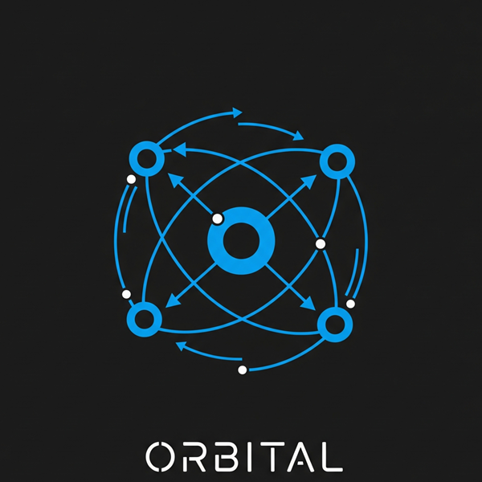

# ORBITAL

_Observable Reducer for Behavior, Interaction, Transictions Actions & Logic_

The idea behind ORBITAL is to provide a centralized and reliable way to manage global states with predictable outcomes.

## What problem does it solve?
Some python applications have complex and dynamic states, such as reactive systems (like those with UI frameworks), automation and robotics software, games, simulations and others. At those systems, multiple modules should react to events, should be able to alter the state and read from the same global state in a reliable and predictable way.

# Status
Currently, ORBITAL is a Work in Progress, being developed whenever I have time. At a future point, where the core of the library is stable, I plan to add some guidelines on how to contribute to the project.

## Roadmap:
The `Issues` section currently provides a rough roadmap of what is planned for the next development steps.
A documentation should be provided in github pages when a basic api of the library is established.